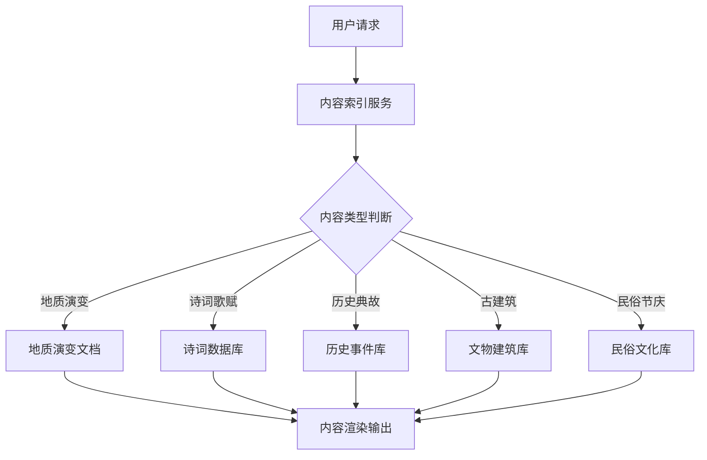

## Product Overview

西湖历史文化内容扩充项目，旨在为现有内容增添详实的历史文化资料，全面展现西湖作为世界文化遗产的深厚底蕴。通过结构化的内容编排，将西湖的自然演变与人文积淀有机结合，构建一个权威、生动且具有深度的历史文化知识库。

## Core Features

- **西湖形成与演变**：详细描述西湖地质成因、历代疏浚工程及水域变迁过程
- **历代诗词歌赋**：收录唐宋至明清文人关于西湖的经典诗词、散曲与题咏
- **历史事件与典故**：记述发生在西湖周边的重要历史事件及名人轶事
- **古建筑与文物**：介绍西湖周边寺庙、塔阁、园林等古建筑及碑刻文物
- **民俗与节庆**：描述西湖周边的传统民俗活动及特色节庆文化

## Tech Stack

- **内容存储格式**: Markdown (便于维护和阅读)
- **结构化数据**: JSON (用于元数据和索引管理)

## Tech Architecture

### 系统架构

采用文档驱动的内容管理架构。内容以Markdown文件形式组织，通过JSON索引文件实现快速检索和关联查询。



### 模块划分

- **核心内容模块**: 存储五大核心主题的详细Markdown文档
- **索引管理模块**: 维护内容分类、关键词及关联关系的JSON索引
- **引用规范模块**: 确保史料引用的格式统一和来源可追溯

## Implementation Details

### 核心目录结构

```
expand-west-lake-history/
├── content/
│   ├── formation/           # 西湖形成与演变
│   │   ├── geological-origin.md
│   │   ├── dredging-history.md
│   │   └── landscape-evolution.md
│   ├── poetry/              # 历代诗词歌赋
│   │   ├── tang-dynasty.md
│   │   ├── song-dynasty.md
│   │   └── ming-qing.md
│   ├── events/              # 历史事件与典故
│   │   ├── key-events.md
│   │   └── historical-anecdotes.md
│   ├── architecture/        # 古建筑与文物遗迹
│   │   ├── temples.md
│   │   ├── pagodas.md
│   │   └── cultural-relics.md
│   └── folklore/            # 传统民俗与节庆
│       ├── festivals.md
│       └── customs.md
├── data/
│   └── index.json           # 内容索引与关联数据
└── references/              # 参考史料文献目录
```

### 关键数据结构

**ContentIndex**: 定义内容索引的核心结构，包含分类、关键词和关联信息。

```typescript
interface ContentIndex {
  category: string;
  title: string;
  path: string;
  keywords: string[];
  relatedTopics: string[];
  references: string[];
}
```

**CitationEntry**: 规范史料引用的格式，确保学术严谨性。

```typescript
interface CitationEntry {
  source: string;        // 史料名称
  author: string;        // 作者/编撰者
  dynasty: string;       // 朝代
  excerpt: string;       // 引用原文
  comment: string;       // 注释说明
}
```

### 技术实施计划

1. **建立内容分类体系**

- 问题：需要清晰的内容组织结构
- 方案：按五大主题建立目录树，使用JSON维护索引
- 关键技术：Markdown + JSON Schema
- 实施步骤：创建目录结构，编写index.json模板，定义分类元数据

2. **史料引用规范化**

- 问题：确保引用的权威性和可追溯性
- 方案：建立统一的引用格式标准
- 关键技术：正则表达式校验
- 实施步骤：制定引用规范，创建参考文献列表，编写校验脚本

3. **内容关联映射**

- 问题：不同主题间存在交叉引用
- 方案：在索引中建立关联关系图
- 关键技术：图数据结构
- 实施步骤：分析内容关联点，更新index.json关联字段，实现交叉链接

### 集成点

- Markdown文件通过Front Matter定义元数据
- JSON索引文件作为内容检索的中心入口
- 引用规范贯穿所有内容文档

## 设计风格

采用**新中式典雅风格**，融合传统美学与现代排版。界面简洁大方，以阅读体验为核心，突出文字内容的权威性与文化气息。

## 设计内容描述

### 页面规划

1. **总览页**: 展示五大主题概览，配以西湖水墨意境背景图
2. **主题详情页**: 每个主题独立页面，左侧导航锚点，右侧内容区
3. **诗词展示页**: 采用竖排或古典排版展示诗词原文

### 单页区块设计

1. **顶部导航区**: 简洁的文字导航，包含当前主题标识
2. **内容标题区**: 主标题配以古典装饰纹样，简要说明文字
3. **正文内容区**: 优化的阅读排版，适当的留白，引用内容采用特殊样式标注
4. **侧边目录区**: 当前章节目录，支持快速跳转
5. **底部关联区**: 推荐阅读相关内容，返回顶部按钮

### 响应式设计

- 桌面端：左侧固定导航，右侧滚动内容
- 移动端：顶部折叠导航，内容单列流式展示

## Agent Extensions

### SubAgent

- **code-explorer**
- Purpose: 深入分析现有项目结构，了解当前内容组织方式和文件架构
- Expected outcome: 明确项目现有结构，确定新内容的最佳集成位置，避免与现有内容冲突