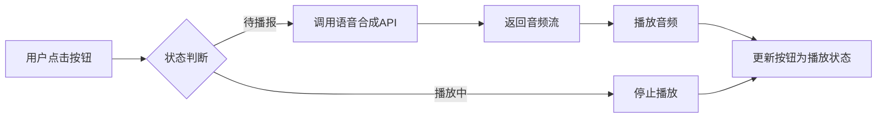

## Product Overview

优化现有应用的语音合成体验及语音播报按钮UI，提升交互自然度与视觉一致性。

## Core Features

- 语音合成优化：调整语调变化与节奏，减少机械感，提升自然度。
- 按钮UI重构：严格遵循TDesign设计规范，统一色彩、圆角及交互反馈效果。
- 视觉效果：实现符合TDesign风格的现代化按钮外观，确保交互流畅。

## Tech Stack

- 前端框架：React
- 组件库：TDesign React
- 样式方案：CSS Modules 或 Tailwind CSS（视项目现有配置）

## 技术架构

### 系统架构

- 架构模式：组件化架构
- 涉及模块：语音服务模块、UI交互模块
- 数据流：用户点击 → 调用合成API → 播放音频 → 更新按钮状态

### 模块划分

- **语音合成模块**：负责调用语音合成API，处理文本转语音逻辑，优化语调与节奏参数。
- **UI组件模块**：基于TDesign规范封装语音播报按钮，处理点击、加载、播放等状态展示。

### 数据流



## 实现细节

### 核心目录结构

```
project-root/
├── src/
│   ├── components/
│   │   └── VoiceButton.tsx      # 新增/修改：遵循TDesign的语音按钮组件
│   ├── services/
│   │   └── ttsService.ts        # 修改：优化参数配置的语音合成服务
│   └── types/
│       └── voice.ts             # 新增/修改：语音相关类型定义
```

### 关键代码结构

**TTS配置接口**：定义语音合成的核心参数，用于控制语调、语速和音量，以实现更自然的合成效果。

```typescript
interface TTSConfig {
  text: string;
  pitch: number;    // 音调，范围0-2，1为正常
  rate: number;     // 语速，范围0.1-2，1为正常
  volume: number;   // 音量，范围0-1
}
```

**VoiceButton组件**：基于TDesign Button封装的状态感知型按钮，处理播放、暂停及加载状态。

```typescript
interface VoiceButtonProps {
  textToSpeak: string;
  onPlayStart?: () => void;
  onPlayEnd?: () => void;
}

const VoiceButton: React.FC<VoiceButtonProps> = ({ textToSpeak, onPlayStart, onPlayEnd }) => {
  // 实现播放逻辑及TDesign样式应用
};
```

### 技术实施计划

1. **问题陈述**：语音合成机械感强，按钮样式不符合规范。
2. **解决方案**：引入TDesign组件库替换现有按钮，调整TTS API的Pitch与Rate参数。
3. **关键技术**：React Hooks（useState, useEffect）、TDesign React、Web Speech API或第三方TTS SDK。
4. **实施步骤**：

- 升级并安装TDesign React依赖。
- 修改ttsService.ts，增加语调与节奏动态调整逻辑。
- 使用TDesign Button组件重构VoiceButton.tsx，应用主题色与状态样式。

5. **测试策略**：对比优化前后音频样本，验证按钮交互状态（Hover/Active/Loading）是否符合规范。

### 集成点

- UI层与业务逻辑层通过Props传递文本内容。
- 按钮组件通过回调函数通知上层播放开始与结束事件。

## 设计风格

采用TDesign企业级设计风格，强调秩序感与实用性。通过统一的色彩系统、圆角半径和微交互反馈，打造专业、高效的语音交互界面。

## 页面规划

本项目不涉及新建页面，主要聚焦于**语音播报按钮组件**的重新设计与优化。

## 单页面块设计（语音播报按钮）

1. **默认状态**：使用TDesign主色（Brand Blue）填充，搭配白色播放图标，圆角为6px（或遵循TDesign全局配置），展现清晰的引导性。
2. **悬停状态**：背景色加深，添加轻微阴影（0 2px 8px rgba(0,0,0,0.12)），提供可交互暗示。
3. **点击/激活状态**：背景变为深蓝色或变为停止图标，按钮轻微内缩，给予触觉反馈。
4. **加载状态**：显示TDesign Loading动画，按钮禁用交互，防止重复点击。
5. **禁用状态**：背景变为灰色，图标颜色变淡，明确不可用性。

## 响应式与交互

- 按钮尺寸适配不同容器，保持最小点击区域44x44px。
- 图标切换（播放/暂停/停止）伴随透明度或位移过渡，时长200ms。